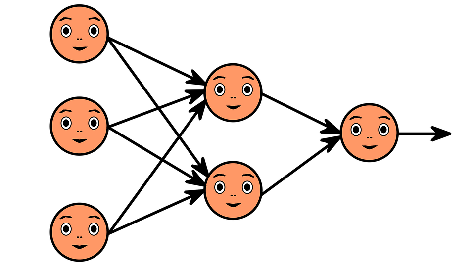
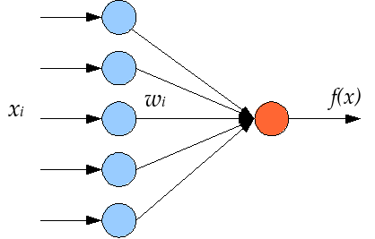
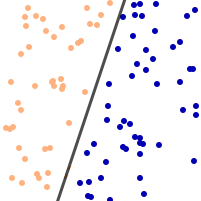

# Single-Layer-Perceptron

Perceptrons are the building block of artificial neural networks. You can think of these are individual neurons of the neural network.

**Here's how a simple artificial neural network looks like**

Each of these circles can be called as an individual perceptron.

A perceptron is a simple program that takes in a bunch of inputs and transforms them into an output.

**Visual representation of a perceptron**

The perceptron has a bunch of weights which are initially just random numbers.

The output of the perceptron is the function of these weights along with the inputs that are passed in.

"Training" the neuron generally means adjusting the weights to make so that the output is closer and closer to the correct answer.

# What can a single perceptron do?

> If you think about it, it looks as if the perceptron consumes a lot of information for very little output - just 0 or 1. How could this ever be useful on its own?
>
> There is indeed a class of problems that a single perceptron can solve. Consider the input vector as the coordinates of a point. For a vector with n elements, this point would live in an n-dimensional space. To make life (and the code below) easier, let’s assume a two-dimensional plane. Like a sheet of paper.
>
> Further consider that we draw a number of random points on this plane, and we separate them into two sets by drawing a straight line across the paper:
> Points on the paper, and a line across
>
> This line divides the points into two sets, one above and one below the line. (The two sets are then called linearly separable.)
>
> 
>
> A single perceptron, as bare and simple as it might appear, is able to learn where this line is, and when it finished learning, it can tell whether a given point is above or below that line.
> [source](https://appliedgo.net/perceptron/)
